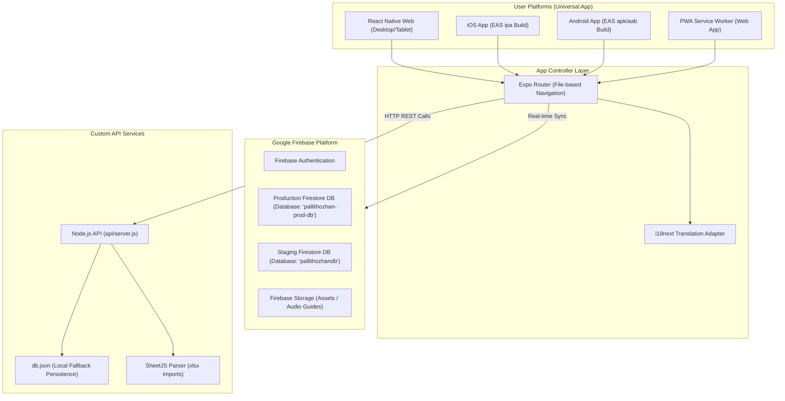
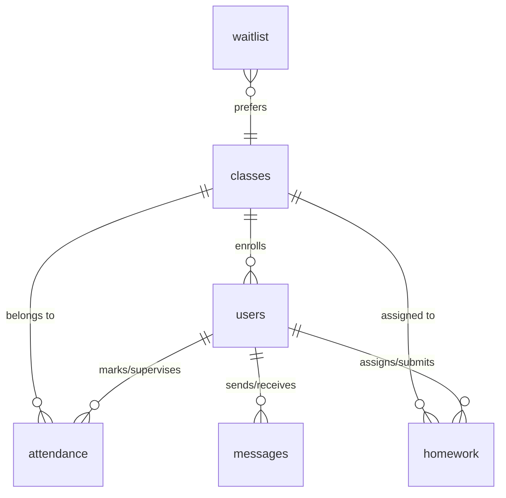

# Balar Malar Pallithozhan Portal Architecture

This document provides a comprehensive overview of the Balar Malar Pallithozhan Portal, including the technologies used, application architecture, database schemas, and the end-to-end deployment workflows.

---

## 1. System Overview & Technology Stack

The portal is designed as a hybrid platform that unifies school management, class check-ins, real-time messaging, and waitlist management. It compiles to multiple platforms (Web, iOS, Android, and PWA) using a single codebase.

| Component | Technology | Role |
| :--- | :--- | :--- |
| **Frontend UI (Core)** | React 19.1.0, React Native 0.81.5 | Builds native mobile application layout and components. |
| **UI Web Adapter** | React Native Web (expo-router) | Translates React Native views to responsive browser HTML/CSS. |
| **PWA Features** | Expo Router PWA Service Workers | Offline support, local asset caching, and standalone install capability. |
| **Styling** | Vanilla CSS, React Native Stylesheets | Theme-compliant, highly responsive grids, and blur-filtered overlays. |
| **App Routing** | Expo Router v6 (File-based) | Handles paths, modal overlays, and links on both web and native platforms. |
| **Language Translation** | i18next & react-i18next | Real-time dynamic toggle between English and Tamil. |
| **Primary Database** | Cloud Firestore | Real-time document store for student, class, and message resources. |
| **Asset Storage** | Firebase Storage | Stores student profile photos, homework files, and voice guide recordings. |
| **User Authentication** | Firebase Authentication | Manages logins, registrations, and role permissions. |
| **Lightweight API** | Node.js (Express-style routing) | Service endpoints under `api/` for health telemetry and data sync. |
| **Data Imports** | xlsx (SheetJS) | Parses waitlist files imported from school spreadsheets. |
| **Version Control** | Git | Managed on GitHub. Branch partitioning for test/dev pipelines. |
| **Web Deployment** | Vercel | Automatic CI/CD deployment pipelines on commit triggers. |
| **Mobile Deployment** | Expo Application Services (EAS) | Orchestrates iOS App Store and Android Play Store build profiles. |

---

## 2. End-to-End Architecture Flow



---

## 3. Database Schema & Firestore Collections

The platform runs two partitioned database instances (Staging and Production) based on the browser hostname or env context.

### Database Instances
* **Staging Database ID**: `pallithozhandb` (used for local development and Vercel preview branch builds)
* **Production Database ID**: `pallithozhan-prod-db` (used on the production domain and EAS native production builds)

### Core Collections & Document Schemas



#### A. `users`
Represents teachers, students, parents, and administrative board members.
* **Document ID**: `uid` (string)
* **Schema**:
  ```json
  {
    "uid": "string",
    "name": "string",
    "email": "string",
    "role": "admin | teacher | parent",
    "phone": "string",
    "activeBranch": "parramatta | sevenhills | blacktown",
    "children": ["student_id_1", "student_id_2"],
    "classId": "string", // If student/teacher
    "createdAt": "timestamp"
  }
  ```

#### B. `waitlist`
Holds student registration requests pending review and class assignment.
* **Document ID**: Auto-generated string
* **Schema**:
  ```json
  {
    "uid": "string",
    "school_code": "BMPM",
    "year": "string",
    "student_id": "string",
    "student_email": "string",
    "given_name": "string",
    "family_name": "string",
    "gender": "Male | Female",
    "DATE_OF_BIRTH": "DD/MM/YYYY",
    "mainstream_school_name": "string",
    "mainstream_school_class": "string",
    "class_name": "string",
    "parent1_name": "string",
    "parent1_email": "string",
    "parent1_mobile": "string",
    "parent1_volunteer": "YES | NO",
    "parent2_name": "string",
    "parent2_email": "string",
    "parent2_mobile": "string",
    "parent2_volunteer": "YES | NO",
    "Purpose": "Transfer | Enrollment",
    "Request": "Online Form | Email",
    "RequestDate": "DD/MM/YYYY",
    "OK_TO_ISSUE_BOOKS": "YES | NO",
    "STATIONARY_ISSUED": "YES | NO",
    "BOOKS_ISSUED": "YES | NO",
    "createdAt": "timestamp"
  }
  ```

#### C. `attendance`
Stores the daily marked check-ins for classes and staff.
* **Document ID**: `${classId}_${date}`
* **Schema**:
  ```json
  {
    "recordId": "string",
    "classId": "string | teacher_attendance | volunteer_attendance",
    "date": "YYYY-MM-DD",
    "markedBy": "string (user_id)",
    "markedByName": "string",
    "rolls": {
      "student_user_id_1": "present | absent | late",
      "student_user_id_2": "present"
    },
    "approved": "boolean"
  }
  ```

#### D. `pending_approvals`
Holds attendance logs requiring administrator review before writing to `attendance`.
* **Document ID**: Auto-generated string
* **Schema**:
  ```json
  {
    "approvalId": "string",
    "classId": "string",
    "date": "YYYY-MM-DD",
    "markedBy": "string",
    "rolls": "object",
    "submittedAt": "timestamp"
  }
  ```

#### E. `homework`
Weekly assignments posted by class teachers, featuring text summaries, attachment links, and audio guide references.
* **Document ID**: Auto-generated string
* **Schema**:
  ```json
  {
    "homeworkId": "string",
    "classId": "string",
    "title": "string",
    "description": "string",
    "dueDate": "YYYY-MM-DD",
    "audioUrl": "string", // Firebase Storage audio guide reference
    "attachmentUrl": "string",
    "createdAt": "timestamp"
  }
  ```

#### F. `messages`
Supports real-time parent-teacher-admin communication channels.
* **Document ID**: Auto-generated string
* **Schema**:
  ```json
  {
    "messageId": "string",
    "senderId": "string",
    "receiverId": "string",
    "content": "string",
    "timestamp": "timestamp",
    "unread": "boolean"
  }
  ```

---

## 4. Git & Deployment Pipeline

### Git Branching Strategy
* **`dev` Branch**: Used to build and test features. Pushing to `dev` automatically triggers a **Vercel Preview Deployment** that hooks into the staging resources.
* **`main` Branch**: Production-ready codebase. Pushing to `main` triggers the **Vercel Production Deployment** connecting to the production database and storage buckets.

### Deployment Channels
1. **Web Deployment (Vercel)**:
   * Node.js script wrapper at `scripts/build-web.js` compiles React Native to web static assets via Metro.
   * Exports compilation build to the `dist` directory.
   * Serverless routing rules map custom subdomains directly to the web portal.
2. **Mobile Deployment (EAS)**:
   * Run commands `expo start --web` and `expo run:ios` locally to verify native package wrappers.
   * Build profiles in `eas.json` define staging and production release targets.
   * EAS builds upload direct artifacts to Google Play Console and Apple App Store Connect.
